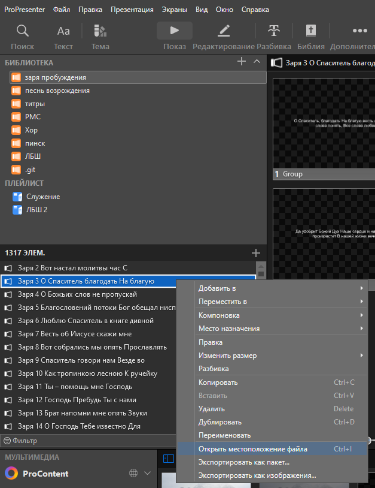

## Цель репозитория

Данный репозиторий содержит библиотеки презентаций для программного обеспечения ProPresenter церкви Church4u.

На данный момент основной целью репозитория является предоставление возможности использовать презентации сборника христианских песен "Заря пробуждения" в программном обеспечении ProPresenter для всего технического сообщества церквей.

## Как установить?

Репозиторий предоставляет готовые релизы презентаций (см. [Releases](https://github.com/yadabygit/church4u_pro_presenter/releases/latest)). Новые релизы появляются по мере исправления ошибок в текущем списке произведений и/или пополнения репозитория новыми произведениями.

Чтобы установить библиотеку для вашего программного обеспечения ProPresenter необходимо:

### Скачать релиз репозитория на локальный компьютер

см. [Releases](https://github.com/yadabygit/church4u_pro_presenter/releases)

### Установить релиз в директорию презентаций ProPresenter

#### Открыть директорию презентаций ProPresenter

Если вы устанавливали ProPresenter с параметрами по умолчанию, то директория презентаций ProPresenter храниться по следующему пути:
`C:\Users\<Имя Пользователя>\Documents\ProPresenter\Libraries` или `C:\Пользователи\<Имя Пользователя>\Документы\ProPresenter\Libraries`

Если в директории по умолчанию вы не можете найти библиотеки презентаций, то узнать точный путь можно следующим способом:
1. в ProPresenter откройте контекстное меню нажав правой кнопкой мышм на элемент любой библиотеки (Библиотека -> Элементы -> Нажать правой кнопкой мыши)
2. в контекстном меню выберите пункт "Открыть местоположение файла". Откроется проводник с полным путем к элементу библиотеки

#### Скопировать релиз репозитория в директорию презентаций ProPresenter

Релиз репозитория содержит все возможные директории презентаций. Скопируйте необходимые вам директории из релиза репозитория в директорию презентаций ProPresenter. (Например, скопировать директорию "заря пробуждения" в `C:\Users\<Имя Пользователя>\Documents\ProPresenter\Libraries`)

#### Обновить список библиотек в ProPresenter

Обновление выполняется автоматически. Вам необходимо только запустить ProPresenter и он обновит скисок доспупных библиотек самостоятельно. 

## Поддержать

Вы можете помочь в развитии проекта присылая нам исправления ошибок в репозитории. Ошибки будут исправляться. После исправления появится новый релиз, который смогут получить все пользователи репозитория

Присылать нам исправления можно архивом или через коммиты Git

Получить архив можно следующим образом:
1. Исправьте ошибки в ProPresenter
2. Перейдите в директорию презентаций ProPresenter (обычно `C:\Users\<Имя Пользователя>\Documents\ProPresenter\Libraries`. Если нет - смотри инструкцию выше)
3. Создайте из директории исправленной библиотеки архив
4. Свяжитесь с нами и передайте полученный архив

После проверки ваши исправления попадут в общий репозиторий
